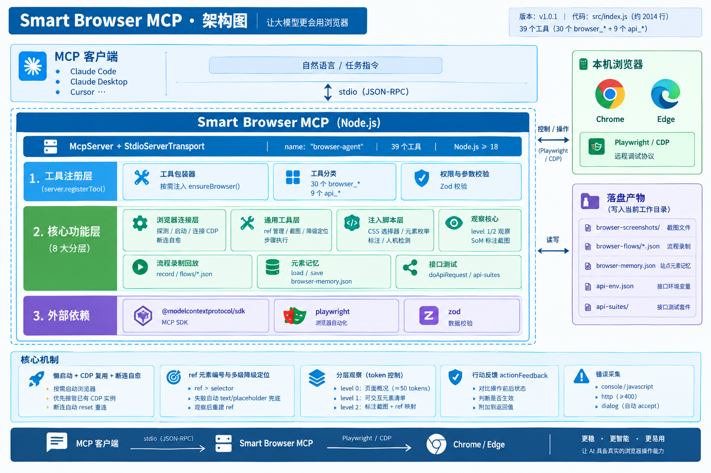

# 架构说明



> 适用版本：v1.0.1 ｜ 对应源码：`src/index.js`（约 2014 行，单文件实现）

本文说明 Smart Browser MCP 的分层结构、核心机制与扩展方式，便于二次开发与问题定位。

---

## 1. 概览

```
MCP 客户端（Claude Code / Claude Desktop / Cursor …）
        │  stdio（JSON-RPC）
        ▼
   Smart Browser MCP  ──Playwright / CDP──►  本机 Chrome / Edge
        │
        └─ 落盘产物（写入客户端进程的当前工作目录）
```

| 项 | 说明 |
| --- | --- |
| 传输层 | `McpServer` + `StdioServerTransport`，纯 stdio，无监听端口 |
| 服务标识 | `name: "browser-agent"` |
| 工具数量 | 39 个（30 个 `browser_*` + 9 个 `api_*`） |
| 外部依赖 | `@modelcontextprotocol/sdk`、`playwright`、`zod` |
| 运行环境 | Node.js ≥ 18，主要面向 Windows（Chrome / Edge） |

设计取向是「**让模型少猜、让失败可降级**」：不要求模型写 CSS 选择器，不要求一次观察就成功，不要求页面状态永远稳定。

---

## 2. 源码分层

`src/index.js` 自上而下分为 8 个区块：

| # | 区块 | 主要实现 | 职责 |
| --- | --- | --- | --- |
| 1 | 浏览器连接层 | `findBrowser` `cdpReady` `waitForCdp` `startChrome` `shutdownChrome` `ensureBrowser` `ensurePage` `initBrowser` `resetBrowserState` | 探测/启动浏览器、连接 CDP、断连自愈 |
| 2 | 通用工具层 | `result` `ensureDir` `captureScreenshot` `resetRefs` `addRef` `resolveTarget` `clickWithBackup` `fillWithBackup` `runSteps` `actionFeedback` | ref 管理、降级定位、截图、步骤执行 |
| 3 | 注入脚本层 | `cssPath` `visible` `COLLECT_ELEMENTS` `MARK_ELEMENTS` `DETECT_CAPTCHA` | 在页面上下文里枚举元素/画标注框/检测人机校验 |
| 4 | 观察核心 | `observeElements`（level 1）`markScreenshot`（level 2）`detectCaptcha` | 生成元素清单与标注截图，统一重建 ref |
| 5 | 工具注册层 | `server.registerTool` 包装器 + 各工具定义 | 注册 39 个工具，按需注入 `ensureBrowser()` |
| 6 | 流程录制回放 | `recordStep` + `flowsDir` | 录制/回放 `browser-flows/*.json` |
| 7 | 元素记忆 | `loadMemory` `saveMemory` | 站点元素映射持久化到 `browser-memory.json` |
| 8 | 接口测试 | `doApiRequest` `runOneCase` `runApiCases` `formatSuiteReport` `mask` `getByPath` | 与浏览器无关的纯 HTTP 测试能力 |

进程启动只有一行：`await server.connect(new StdioServerTransport())`。

---

## 3. 核心机制

### 3.1 懒启动 + CDP 复用 + 断连自愈

浏览器**不在进程启动时拉起**，而由工具包装器按需触发：

```js
const _registerTool = server.registerTool.bind(server);

server.registerTool = (name, meta, handler) => {
    if (noBrowserTools.has(name)) {
        return _registerTool(name, meta, handler);
    }
    return _registerTool(name, meta, async (args) => {
        await ensureBrowser();      // 只有需要浏览器的工具才初始化
        return handler(args);
    });
};
```

- `noBrowserTools` 白名单 15 项（6 个元操作工具 + 9 个 `api_*`），调用它们不会拉起浏览器，因此在没有 Chrome 的环境里也能正常返回
- `startChrome` 先探测 CDP 端口：**已有实例直接接管**，保留登录态与扩展；否则才 `spawn` 新进程
- 启动参数：`--remote-debugging-port` `--user-data-dir` `--disable-features=Translate` `--no-first-run` `--no-default-browser-check`
- 自愈路径：`browser.isConnected() === false` → `resetBrowserState()`（清空 `browser/context/page`、`listenedPages`、`refMap`）→ 下次调用走完整重连

### 3.2 ref 元素编号与多级降级定位

观察时给每个可交互元素分配短编号，后续操作用编号定位：

```js
refMap[ref] = { selector, backupType, backupValue }   // ref: e1, e2, e3 …
```

- `browser_observe` / `browser_elements` / `browser_mark_screenshot` **每次都会 `resetRefs()`**，因此 ref 的生命周期等于「最近一次观察」：页面结构变化后需重新观察
- 定位优先级：`ref` → `selector`；命中后若 Playwright 定位失败，自动兜底：
  - 点击：`getByText(backupValue, { exact: true })`
  - 输入：`getByPlaceholder(backupValue)`
- 兜底生效时返回值里会标注 `(via text fallback)` / `(via placeholder fallback)`，便于判断是否退化

### 3.3 分层观察（token 控制）

| level | 返回内容 | 相对开销 |
| --- | --- | --- |
| 0 | `url` / `title` / 错误数 / captcha 标志 | 约 50 tokens |
| 1 | 可交互元素清单（`ref` + `text/name/placeholder/type` + `selector`） | 中等 |
| 2 | Set-of-Mark 标注截图（JPEG q60）+ 编号到 ref 的映射 | 较大 |

SoM 标注通过注入 `.mcp-mark-overlay` 覆盖层实现；无论截图成功与否，`finally` 中都会清理覆盖层，避免红框残留干扰后续操作。

### 3.4 行动反馈 `actionFeedback(before)`

每次点击/输入/按键后自动对比操作前后：URL 是否变化、是否新增错误、页面是否稳定，把结果直接附在工具返回值里，模型无需额外调用即可判断「操作是否生效」。

### 3.5 错误采集

`attachListeners` 按 page 去重注册监听，统一写入环形缓冲（上限 `MAX_ERRORS = 200`）：

| 类型 | 来源 |
| --- | --- |
| `console` | 控制台 `error` 级别日志 |
| `javascript` | `pageerror` 未捕获异常 |
| `http` | 响应状态 ≥ 400 |
| `dialog` | 原生 `alert` / `confirm` / `prompt`（**自动 accept**，并记录，防止操作卡死） |

---

## 4. 状态与产物

### 4.1 进程内状态（全局单例）

| 变量 | 说明 |
| --- | --- |
| `browser` / `context` / `page` | 浏览器连接与当前页面（单例） |
| `refMap` / `refCounter` | 元素编号映射，观察时重建 |
| `errors` | 错误环形缓冲（≤ 200） |
| `recording` | 流程录制状态 `{ name, steps[] }` |
| `listenedPages` | 已注册监听的页面集合 |
| `browserInitPromise` | 初始化去重/失败可重试 |

### 4.2 落盘产物（写入 `process.cwd()`，默认已被 `.gitignore` 忽略）

| 路径 | 内容 |
| --- | --- |
| `browser-screenshots/` | 截图文件 |
| `browser-flows/*.json` | 录制的操作流程 |
| `browser-memory.json` | 站点元素记忆 |
| `api-env.json` | 接口测试环境变量 |
| `api-suites/` | 接口测试套件 |

---

## 5. 典型调用链

```
browser_open
  └─ ensureBrowser() → 探测 CDP / 启动浏览器 → goto → actionFeedback

browser_observe(level 1)
  └─ page.evaluate(COLLECT_ELEMENTS) → resetRefs() → addRef()×N → e1…eN

browser_click(ref = "e3")
  └─ resolveTarget() → refMap["e3"] → clickWithBackup()
       ├─ 成功 → actionFeedback
       └─ 失败 → getByText(text) 兜底 → actionFeedback

browser_observe(level 2)
  └─ page.evaluate(MARK_ELEMENTS) → 绘制编号 → 截图(q60)
       → finally: 清理 .mcp-mark-overlay → 返回 图片 + 映射
```

---

## 6. 新增一个工具

```js
server.registerTool("browser_my_tool", {
    description: "一句话说明这个工具做什么、什么时候用",
    inputSchema: {
        ref: z.string().optional(),
        selector: z.string().optional()
    }
}, async ({ ref, selector }) => {
    const t = resolveTarget({ ref, selector });   // 复用 ref/selector 解析
    await clickWithBackup(t);                     // 复用降级定位
    return result("done");                        // 统一返回格式
});
```

要点：

1. 用 `server.registerTool` 注册即可，**需要浏览器的工具无需自己调用 `ensureBrowser()`**，包装器会自动注入
2. 如果新工具完全不需要浏览器（例如纯文件操作或 HTTP 请求），把它加入 `noBrowserTools` 集合
3. 交互类工具优先消费 `ref`，并复用 `resolveTarget` / `clickWithBackup` / `fillWithBackup` 以获得降级能力
4. 返回值统一用 `result(text)` 包装

---

## 7. 已知约束与改进方向

| 类别 | 现状 | 改进方向 |
| --- | --- | --- |
| 代码组织 | 单文件约 2014 行 | 按上表拆分为 `connection/` `tools/` `flows/` `memory/` `api/` |
| 并发模型 | `page`、`refMap` 为进程级单例 | 上下文按会话/标签页隔离，支持并发任务 |
| ref 生命周期 | 每次观察全局重置 | 改为按页面/命名空间分区 |
| 平台适配 | 默认路径硬编码 Windows Chrome/Edge | 增加 macOS / Linux 探测路径 |
| 输入校验 | `browser_screenshot`、`browser_flow_record`、`api_test_suite` 的 `name` 直接拼入文件路径 | 统一 `path.basename()` 或白名单校验，避免路径穿越 |
| 请求语义 | GET/HEAD 携带 body 时会被静默丢弃 | 显式报错或改写为 POST 提示 |
| 版本一致性 | MCP server 报 `2.0.0`、npm 包为 `1.0.1` | 由单一版本常量统一生成 |

---

## 8. 相关文档

- [README](../README.md) —— 安装、配置、工具清单
- [LICENSE](../LICENSE) —— ISC
